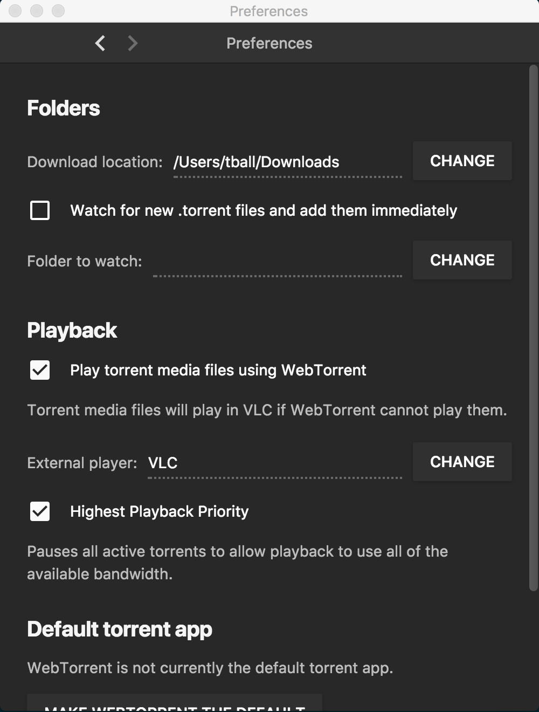
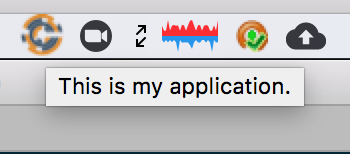
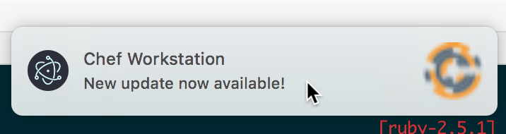

# Chef Workstation Tray Application PoC - Electron

Electron is a JS based platform for building web apps across systems. They run "natively", meaning they can be ran across many operating systems and should function/look the same across all. It is the basis for native applications like Atom and Visual Studio Code.

# Build requirements

* [NodeJS](https://nodejs.org/en/download/)
* [Electron](https://electronjs.org/docs/tutorial/installation)
* `cd chef-workstation-tray-app/electrion && electron .`
* Heavier weight than a native app certainly

# Runtime load / memory footprint

* 34MB memory load while the tray app is running on mac
* Researched mentioned memory leaks but did not see mention of any recently

# Findings

## It is easy to get our UX design in and have it be cross-platform

Customizing our UX would be very easy - all windows are browser windows. Our ability to customize the UX would be limited to our ability to make a website look nice and be functional.

This same strength is also its weakness. We lose almost all system native support except for basic notification support. We are not able to take advantage of something like the Mac native preferences window. But the preferences can be customized how we like - see .

To interact with system native notifications it looks like we could take basic advantage of notifications, but not advanced functionality like custom buttons. But a notification button could say something like "Click on this link to start the update" which opens a browser window (that looks the same across systems) to facilitate the update.

## How does it look across platforms?

#### Windows

#### OSX

Icon and Mouseover

Menu

Notification

Preferences Browser Page

## Long term maintenance cost?

Javascript is a pretty easy language to learn. We could even leverage shared JS resources from our Automate deployment (like Angular) if we wanted to. In maintenance cost I estimate it would be pretty low. We would probably want to spend more time optimizing it and ensuring it worked across operating systems than learning how to create functionality.

Debugging can be done using browser debugging tools, including things like stepping through misbehaving Javascript.

## Menubar application

https://github.com/maxogden/menubar

This was suggested by a community member as a place to start looking. It is really just a wrapper around the core Electron code to create an example Tray app, and allows plugging predefiend values (like tooltip, or window size). We would not want to use this as a core library we depend on but it is a great example to reference if we decide to use Electron.

# Documentation

https://electronjs.org/docs/api
Electron API docs seem good, examples seem plentiful

[Example Electron app](https://github.com/webtorrent/webtorrent-desktop) (no tray portion though)
